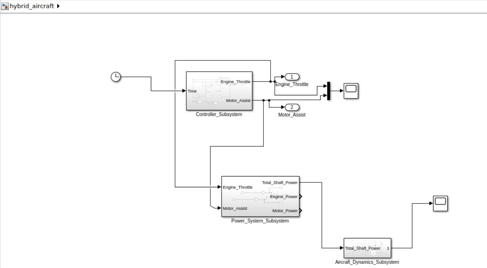

# ✈️ Hybrid Electric Aircraft Concept


A system-level hybrid-electric aircraft modeling project integrating propulsion simulation, nonlinear flight dynamics, CAD modeling, and structural validation.

---

## 🚀 Project Summary

This project demonstrates a simplified longitudinal flight simulation of a parallel hybrid-electric aircraft.  

The propulsion architecture blends:

- Internal Combustion Engine
- Electric Motor Assist
- Shared Shaft Power System

The system models thrust generation, aerodynamic drag feedback, and dynamic velocity response to simulate realistic cruise behavior.

---

## 🧠 System Architecture

### Hybrid Propulsion Layout

<p align="left">
  
</p>

The architecture integrates:

- Hybrid power blending  
- Propeller thrust conversion  
- Aerodynamic drag model  
- Longitudinal flight dynamics loop  

---

## 📈 Simulation Results

### Velocity Response

<p align="right">
  
</p>


The simulation demonstrates:

✔ Initial acceleration  
✔ Nonlinear thrust feedback  
✔ Drag-induced stabilization  
✔ Steady cruise equilibrium  

The system naturally reaches thrust–drag balance, resulting in stable cruise speed.

---

## 🛠 Structural Analysis

### Motor Mount Stress

<p align="center">
  
</p>

### Wing Root Stress

<p align="center">
  
</p>

Structural validation confirms safe stress levels under simulated loading conditions.

Full report available in:

```
05_Structural_Check/stress_report.pdf
```

---

## 🔬 MATLAB Model

The MATLAB framework performs:

- Hybrid power distribution modeling  
- Mission energy estimation  
- Efficiency analysis  
- Performance visualization  

To run:

```matlab
run('parameters.m')
run('mission_simulation.m')
```

---

## 🔧 Simulink Model

The dynamic simulation includes:

- Controller Subsystem  
- Power System Subsystem  
- Aircraft Dynamics Subsystem  

Simulation Time: **1800 seconds**

Outputs:

- Velocity response  
- Thrust vs drag behavior  
- Hybrid power blending effects  

To run:

```
03_Simulink_Model/hybrid_aircraft.slx
```

---

## 🛠 CAD Design (Fusion 360)

Designed components include:

- Aircraft fuselage concept  
- Hybrid engine mount  
- Battery pack layout  
- Propeller assembly  

---

## 📂 Project Structure

```
Hybrid_Electric_Aircraft_Concept/
├── 01_System_Definition/
├── 02_MATLAB_Model/
├── 03_Simulink_Model/
├── 04_CAD_Model_Fusion360/
├── 05_Structural_Check/
└── docs/images/
```

---

## 🎯 Key Achievements

- Realistic cruise equilibrium achieved  
- Nonlinear thrust feedback implemented  
- Drag-based stabilization modeled  
- Hybrid propulsion blending validated  
- Structural feasibility verified  

---

## 🔮 Future Enhancements

- Altitude-dependent air density model  
- Battery state-of-charge simulation  
- Climb and descent dynamics  
- Thermal modeling  
- Hybrid optimization control  

---

## 👨‍💻 Author

**Sujeet Samal**  
Aerospace Engineering  
Hybrid Propulsion & Aircraft Systems  

---

## 📄 License

Educational and research demonstration project.
